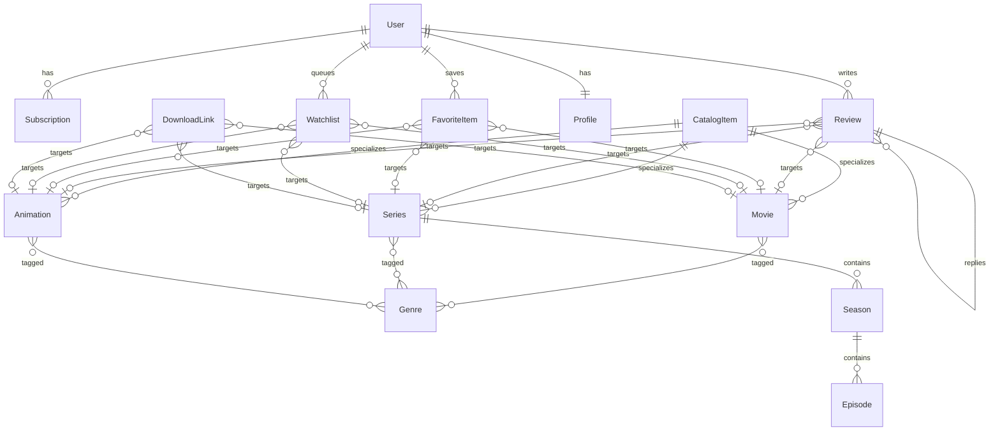

# Phase 1 — Domain & Schema Redesign

## Target ERD (logical)

`CatalogItem` is an **abstract** Django model (no table). Shared columns live on `main_movie` / `main_series` / `main_animation`.

## Key decisions

| Topic | Decision |
|---|---|
| Content hierarchy | Abstract `CatalogItem` + concrete Movie/Series/Animation |
| Season parent | `Season.series` → `Series` (was wrongly `Movie`) |
| Series counts | `season_count` / `episode_count` (renamed); sync via `refresh_episode_counts()` |
| Favorites | Unified `FavoriteItem` with XOR target; removed `FavoriteMovie` + M2M `favorites` |
| Watchlist | Same XOR pattern on `Watchlist` |
| Reviews / replies | Single tree via `Review.parent`; deleted `Reply` model |
| Dead through tables | Removed `MovieGenre`, `MovieActor`, `MovieDirector`, `MovieTag` (M2M is source of truth) |
| Premium | `User.has_premium_access()` from active `Subscription`; `is_premium` cache synced on save |
| Integrity | CheckConstraint XOR + rating range + date order; UniqueConstraint per user/target |
| Indexes | title, release_date, view_count, overall_rating (+ subscription/notification/review) |
| Production DB | PostgreSQL recommended next (Phase 4); local remains SQLite |

## Constraints added

- `review_exactly_one_target`, `review_rating_range_1_10`
- `favorite_exactly_one_target` + unique per (user, movie|series|animation)
- `watchlist_exactly_one_target` + unique per target
- `downloadlink_exactly_one_target`
- `subscription_end_gte_start`
- `series_end_year_gte_start_year`
- `unique_series_season_number`, `unique_season_episode_number`
- wallet / like / playlist / preference uniqueness & range checks

## Migration

- `main/migrations/0027_phase1_domain_redesign.py`
- Data copy: `FavoriteMovie` → `FavoriteItem`, `Reply` → nested `Review`
