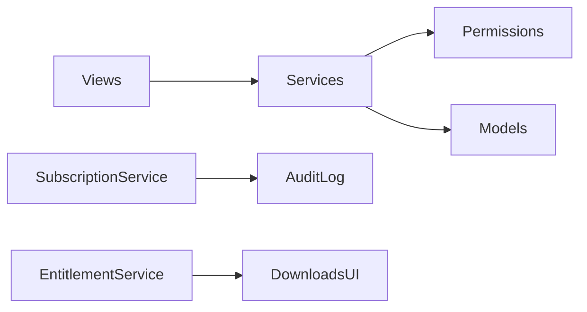

# Phase 2 — Service Layer, RBAC, Entitlement

## Domain map (logical apps inside `main`)

Physical Django app split is deferred to keep migration history stable.
Code is already partitioned by future app boundaries:

| Future app | Code today |
|---|---|
| `catalog` | `main/services/catalog.py`, Movie/Series/Animation models |
| `engagement` | `main/services/engagement.py`, Review/Favorite/Watchlist |
| `billing` | `main/services/billing.py`, Subscription/AuditLog/Entitlement |
| `users` | `main/permissions.py`, User/Profile, auth views |

## RBAC roles

- `anonymous`
- `user` (authenticated)
- `premium` (valid premium subscription **or** staff)
- `staff` (is_staff / superuser)

## Business rules enforced

1. Downloads require premium entitlement (`can_download`).
2. Users cannot self-assign Premium; they may **request** upgrade (AuditLog).
3. Staff assign via `/update-subscription/` or Admin; mock checkout is staff-only.
4. Reviews/replies go through `ReviewService` with domain errors.
5. Non-empty emails are unique (`unique_nonempty_user_email`).
6. Registration requires email + password validators.

## Key modules

- `main/services/` — domain services
- `main/permissions.py` — role helpers + decorators
- `main/exceptions.py` — `DomainError` hierarchy
- `main/models.AuditLog` — audit trail
